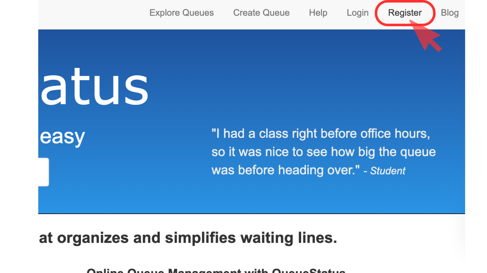
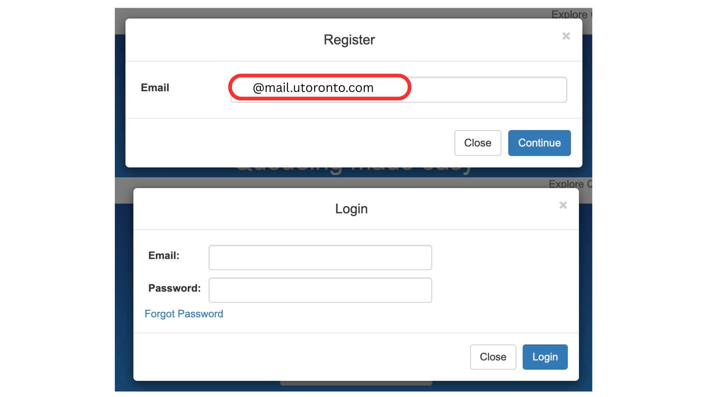
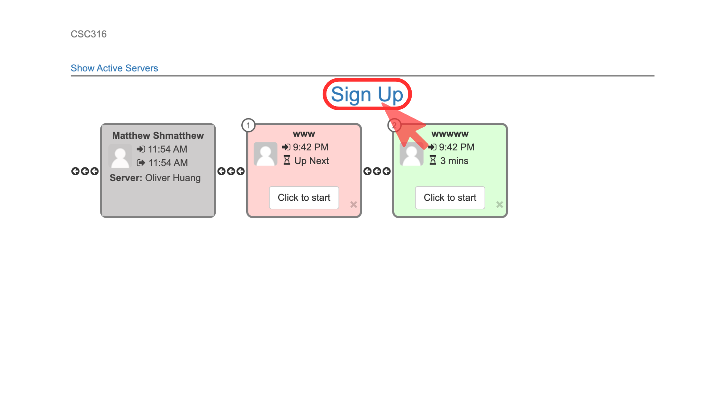
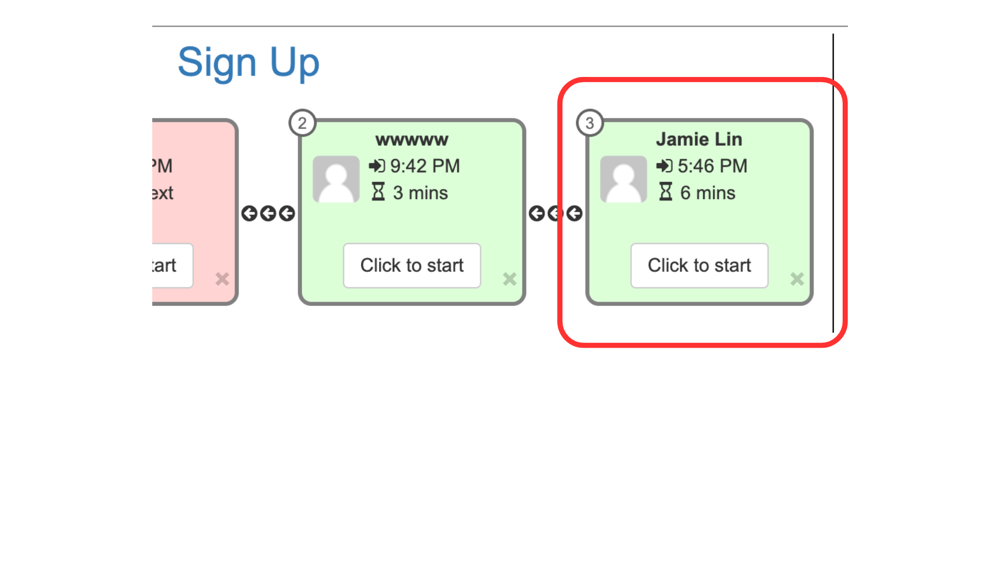
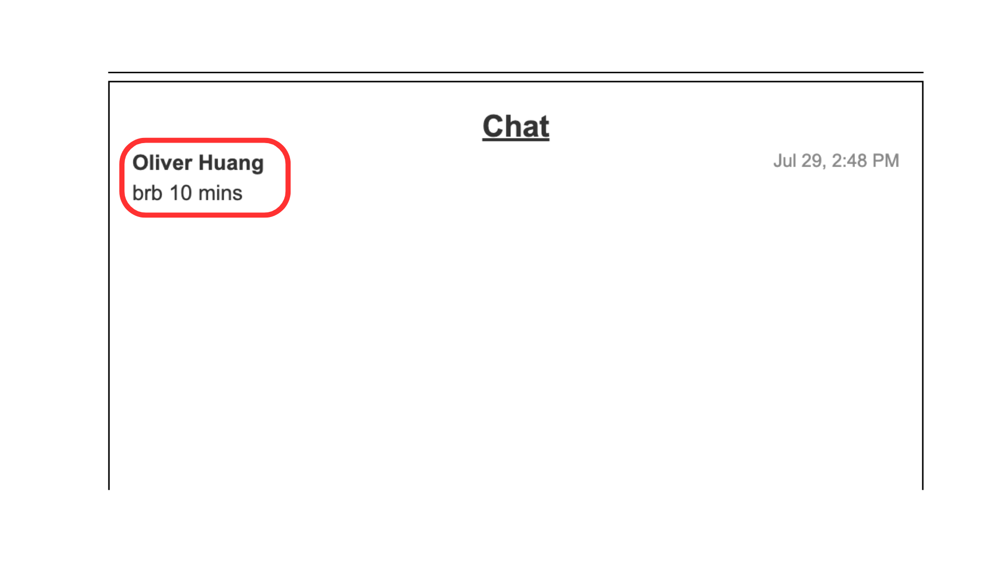

# Student Guide: Joining TA Office Hours via QueueStatus

To ensure office hours are **fair, organized, and efficient**, we use [QueueStatus](https://queuestatus.com) to manage student queues.  
Follow this guide to register, join the queue, and attend your TA’s office hours smoothly.

## 1. Register for a QueueStatus Account

Before joining a queue, you **must create a free account**.

**Steps to Register:**

1. Go to [QueueStatus.com](https://queuestatus.com).  
2. Click **Register** in the top navigation bar.  
3. Enter your email (personal or your school email).  
4. Check your inbox for a **confirmation email**.  
5. Click the confirmation link to activate your account.

> **Tip:** Check spam/junk or Promotions tab if you don’t see the email.

**If you didn’t receive the email:**

- Wait a few minutes—it may take time to arrive.  
- If still missing **and the queue is open**, send a **private Piazza post** to your TA.  
- The TA may **manually add you to the queue** (not possible if the queue is closed).

  

  

---

## 2. Joining a TA’s Queue

Queues open **5 days before** the office hour session.

**Steps:**

1. Visit your TA’s **QueueStatus link** (from the schedule above).  
2. If the queue is **open**, you will see a **Sign Up** button.  
3. If it says **“Queue is currently closed”**, check back later.  
4. Click **Sign Up** and choose:  
   - **Full name** (e.g., Jamie Lin), OR  
   - **Anonymous** (e.g., Anonymous #456)  

> **Important:** Inappropriate names will be removed from the queue.

  

---

## 3. On the Day of Office Hours

1. Check your **position in the queue** on QueueStatus.  
2. When you are **first in line**, click the **Zoom link** at the top of the page.  
3. The TA will admit you when ready.  
4. After your session:  
   - You’ll be **removed from the queue automatically**.  
   - If time permits, you can **rejoin** the queue for another turn.

> **Tip:** Keep QueueStatus open in a browser tab during your session.

  

---

## 4. If You’re Not Ready When Called

If you’re first in line but away briefly:

1. Leave a **note** in QueueStatus chat (e.g.,  
   *“BRB 10 mins – okay to let next person go first.”*)  
2. TA can **skip you temporarily**, and you’ll keep your place for later.  

  

---

## 5. Time Limits & Fair Use

To make sure **everyone gets help**:

- If **4+ students** are in the queue → **15 min max per session**  
- If **<4 students** → **up to 25 min**, depending on demand

> **Pro Tip:** Prepare your questions in advance for efficiency.

---

## 6. Queue Closing Policy

- Queues **close** 1 hour before the office hour starts.  
- Queues may also **close early** if full.  
- If the queue is full, check other **TA time slots** in the schedule.

---
